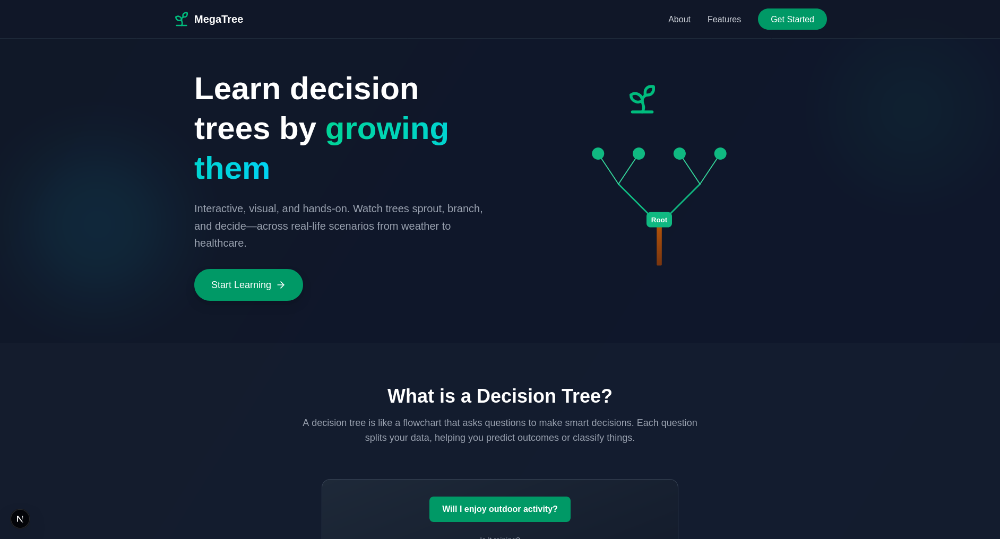
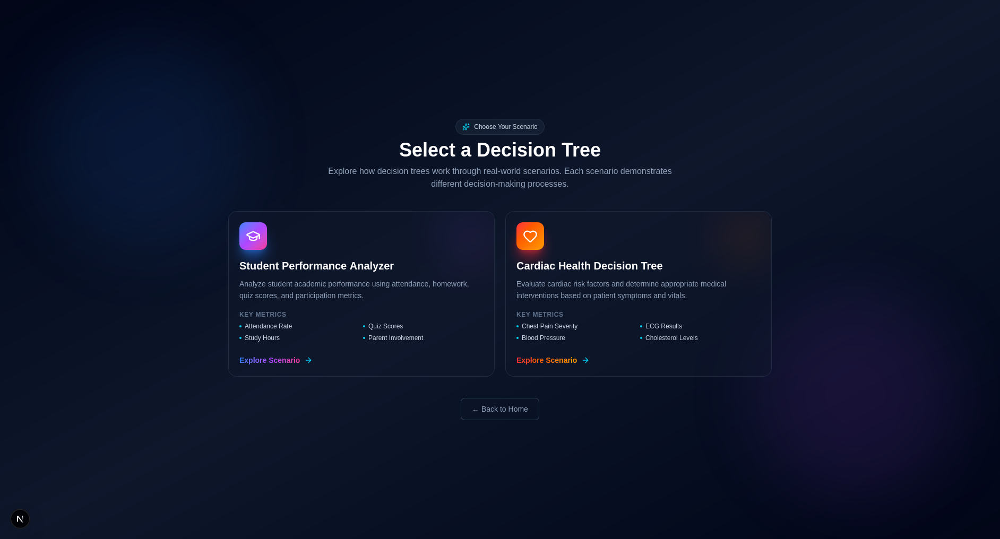
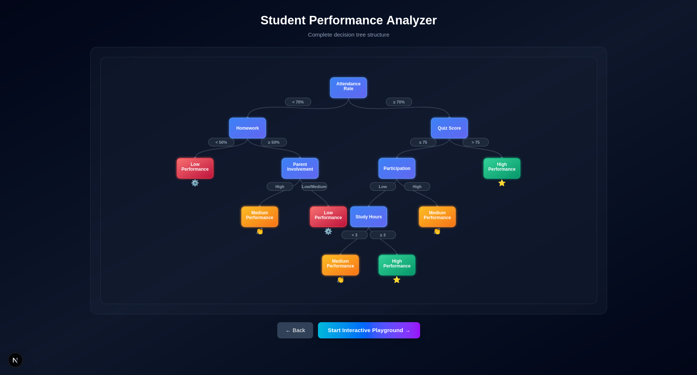
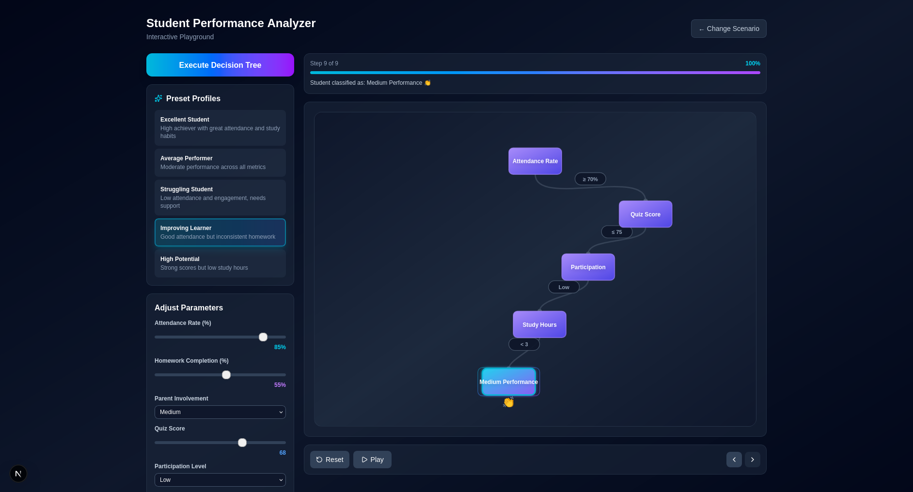

# MegaTree - Decision Tree Visualization

An interactive educational platform for learning decision trees through beautiful visualizations and real-world scenarios.

## screenshots







## 🌟 Features

- **Two Real-World Scenarios**:
  - 📚 **Student Performance Analyzer**: Evaluates academic performance based on attendance, homework, quiz scores, and more
  - ❤️ **Cardiac Health Decision Tree**: Assesses cardiac risk factors for appropriate medical interventions

- **Interactive Learning Flow**:
  1. **Educational Landing Page**: Learn decision tree fundamentals
  2. **Scenario Selection**: Choose your learning path
  3. **Complete Tree View**: See the full decision tree structure
  4. **Interactive Playground**: Adjust parameters and watch decisions unfold in real-time

- **5 Preset Profiles Per Scenario**: Quick-start with pre-configured data sets
- **Beautiful Animations**: Smooth tree traversal with animated edges and nodes
- **Dark Theme**: Easy on the eyes with a modern, professional design
- **Responsive Design**: Works seamlessly across devices

## 🚀 Getting Started

### Prerequisites

- Node.js 18+ or npm package manager

### Installation

```bash
# Install dependencies
npm install

# Run development server
npm run dev
```

The application will be available at `http://localhost:3000`

## 📖 How to Use

1. **Start at Landing Page** (`/`)
   - Learn about decision trees
   - Understand key concepts and terminology

2. **Select a Scenario** (`/scenario`)
   - Choose between Student Performance Analyzer or Cardiac Health Decision Tree

3. **Explore the Scenario** (`/visualize/[scenario]`)
   - **Intro Phase**: Learn about the specific scenario
   - **Full Tree View**: See the complete decision tree structure
   - **Interactive Playground**:
     - Select from 5 preset profiles
     - Adjust individual parameters with sliders
     - Execute the decision tree to see animated visualization
     - Step through the decision-making process

## 🎯 Decision Tree Structures

### Student Performance Analyzer

**Root Node**: Attendance Rate
- Branches based on: Attendance, Homework Completion, Parent Involvement, Quiz Score, Participation, Study Hours
- **Outcomes**: High Performance ⭐, Medium Performance 👏, Low Performance ⚙️

### Cardiac Health Decision Tree

**Root Node**: Chest Pain Severity
- Branches based on: Chest Pain, ECG Results, Blood Pressure, Cholesterol
- **Outcomes**: Emergency 🚨, Treatment 💊, Lifestyle Changes 🏃, Counseling 🥗

## 🛠️ Tech Stack

- **Framework**: Next.js 16 with React 19
- **Styling**: Tailwind CSS v4
- **Language**: TypeScript (strict typing, no `any` types)
- **Icons**: Lucide React
- **Animations**: Framer Motion

## 📁 Project Structure

```
/app
├── app/
│   ├── page.tsx                    # Landing page
│   ├── scenario/
│   │   └── page.tsx                # Scenario selection
│   └── visualize/
│       └── [scenario]/
│           └── page.tsx            # Dynamic visualization page
├── components/
│   ├── StudentAnalyzerComponent.tsx   # Student tree logic & visualization
│   └── CardiologistTree.tsx           # Cardiac tree logic & visualization
└── public/                         # Static assets
```

## 🧪 Preset Profiles

### Student Presets
1. **Excellent Student**: High achiever with great habits
2. **Average Performer**: Moderate performance across metrics
3. **Struggling Student**: Needs support and intervention
4. **Improving Learner**: Good attendance, inconsistent work
5. **High Potential**: Strong scores, low study hours

### Cardiac Presets
1. **Critical Emergency**: Severe symptoms requiring immediate care
2. **High Risk Patient**: Elevated vitals and severe symptoms
3. **Moderate Risk**: Mild symptoms with some abnormalities
4. **Low Risk**: Mild symptoms with normal vitals
5. **Preventive Care**: Occasional discomfort, healthy vitals

## 📝 Important Notes

- **Tree Structures Are Fixed**: Node conditions and decision paths are hardcoded as specified
- **Educational Purpose**: This is a visualization tool for learning decision trees
- **No Backend Required**: All logic runs client-side in the browser

## 🎓 Educational Value

This project demonstrates:
- How decision trees make classification decisions
- The impact of different input parameters on outcomes
- Real-world applications of machine learning concepts
- Visual representation of algorithmic thinking

---

Built with ❤️ for understanding decision trees through visualization
